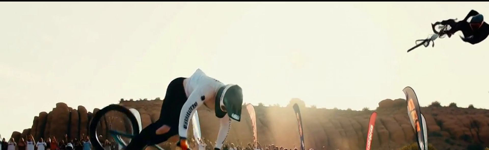

# MiniMax H3 showcase — BMX berm / backflip

Photoreal clip produced with **MiniMax H3** through **Video Buddy** (ComfyUI
`h3_t2v` / fl2va). Public GitHub viewers get these files from the repo — no
Tailscale, no extra host.

The same filenames are mirrored at [`docs/demo/`](../../demo/) so
**your-video-buddy PR #11** can link
`docs/demo/H3-SHOWCASE-BMX-8s-720p.mp4` and `H3-SHOWCASE-BMX-8s-hero.png`.

**Golden-hour BMX berm → backflip → dusty stick. ~8s. MiniMax H3 via Video Buddy / Comfy.**

[](H3-SHOWCASE-BMX-8s-hero.png)

The poster is a still from the same run (rider inverted mid-backflip, red-rock
park, late sun). Open the PNG on github.com for the image.

## Files

| File | What it is |
|---|---|
| [`H3-SHOWCASE-BMX-8s-hero.png`](H3-SHOWCASE-BMX-8s-hero.png) | Poster / still (in-repo). Also at [`docs/demo/`](../../demo/). |
| [`H3-SHOWCASE-BMX-8s.provenance.json`](H3-SHOWCASE-BMX-8s.provenance.json) | Originating Comfy / Buddy run record (local Windows paths stripped). |
| `H3-SHOWCASE-BMX-8s-720p.mp4` | Preferred in-repo playback (~4.1 MB, ~8.0 s, needs `moov`). **Not committed** — launch attaches keep arriving truncated (755 712 bytes, `mdat` only, `ffprobe`: moov atom not found). |
| `H3-SHOWCASE-BMX-8s-1080p.mp4` | Optional 1080p encode (~9.9 MB, 1920×1080). Same attach-cap; omit until a complete file exists. |

Do not commit a file under 1 MB or one that fails `ffprobe` / PNG `IEND`.
Sibling README links that expect `docs/demo/H3-SHOWCASE-BMX-8s-720p.mp4`
will 404 until a complete encode is checked in to **both** folders.

GitHub’s README renderer shows the poster. A committed `.mp4` plays in the
github.com blob viewer (click the file). `<video>` tags are stripped on
README pages.

## Recorded run (from the sidecar)

These values are copied from
[`H3-SHOWCASE-BMX-8s.provenance.json`](H3-SHOWCASE-BMX-8s.provenance.json).
They are the originating machine’s notes, not a published benchmark.

| Field | Value |
|---|---|
| Title | `H3-SHOWCASE-BMX-8s` |
| Seed | `881808` |
| Length | 192 frames @ 24 fps (target 8.0 s) |
| Native size | 1152×640 |
| Model | `gguf/minimax_h3_fl2va_pruned-Q4_K.gguf` |
| LoRA | `minimax_h3_fl2v_turbo_4step_v1.0_768p_comfyui_bf16.safetensors` |
| Sampler | `res_multistep` / `simple`, **4 steps**, **CFG 1.0** |

This sidecar is the original `.provenance.json` from the showcase run. New
Buddy clips write `shot-N.buddy.json` instead — see
[`video_buddy/docs/CLIP_PROVENANCE.md`](../../video_buddy/docs/CLIP_PROVENANCE.md).

## Reproduce (local Comfy + H3 weights)

From `video_buddy/`, after `doctor` shows an H3 loader pick:

```bash
python -m master_agent comfy run --mode generate --variant h3_t2v --prompt "Ultra-photoreal cinematic 8-second shot, MiniMax Hailuo quality. Golden hour in a red-rock desert BMX dirt park. A skilled rider in a dusty jersey and full-face helmet launches a steep dirt berm, pulls a clean backflip mid-air, bike tires catching warm sunlight, then sticks the landing in a soft spray of orange dust."
```

H3 frame counts snap to the **17k+5** grid (do not use LTX `8n+1` lengths).
Operator notes: [`video_buddy/workflows/minimax-h3/README.md`](../../video_buddy/workflows/minimax-h3/README.md).
